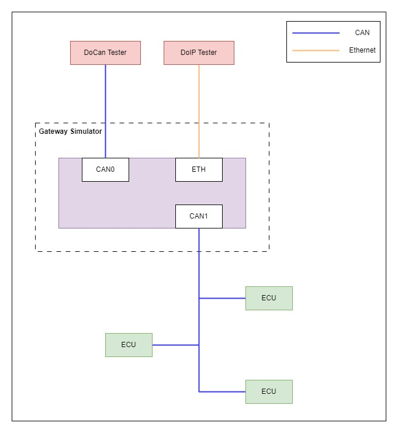

# Communication-simulator-for-automotive-ECU-based-on-STM32
### Project Design Description

#### Framework Overview
The project framework involves a Gateway Simulator acting as the central node, interfacing with both the DoCan Tester and the DoIP Tester via CAN and Ethernet connections, respectively. The ECU nodes are connected through the CAN interfaces, emphasizing the Gateway Simulator's role in routing and managing communications within the automotive body network. Given the complexity and scale of communication between actual vehicle nodes, this project will focus on the routing function of diagnostic communication. This means we will concentrate our efforts on developing and optimizing the data transmission paths related to vehicle diagnostics, ensuring efficient and reliable transfer of diagnostic information between different Electronic Control Units (ECUs). Through this approach, we aim to simplify the complex communication network and enhance the efficiency and accuracy of the diagnostic process. Please refer to the simple pic of architecture for better understanding.

#### Hardware: STM32H750VBt6
The STM32H750VBt6 microcontroller is chosen for its high performance, multiple communication interfaces, and support for complex applications such as automotive body network nodes. This chip offers the following capabilities:
- **High Performance**: Suitable for demanding applications requiring fast processing speeds.
- **Multiple Communication Interfaces**: Supports various communication protocols essential for automotive applications, including CAN and Ethernet.
- **Complex Application Support**: Capable of handling sophisticated tasks like those found in automotive body networks.

#### Software: RT-Thread
RT-Thread is selected as the operating system for its robustness and compatibility with the STM32H750VBt6 microcontroller. It provides a stable platform for developing real-time applications, ensuring efficient management of system resources and facilitating the implementation of the required functionalities, such as CAN and Ethernet communication.