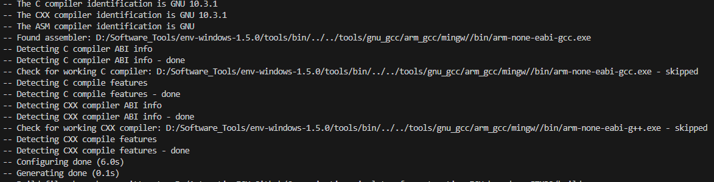
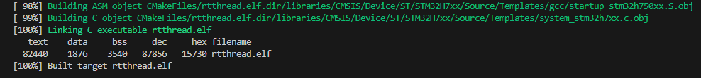
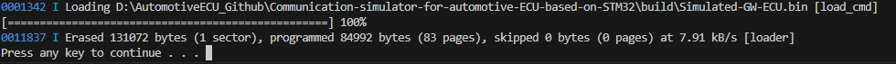

## Here is the guide to use this project

Due to limited resources, currently only able to maintain a development environment based on Windows. I believe it would be easy to migrate to Linux or MacOS environment.

### 1.Compile

#### 1.1 Set right tool path of `CMakeLists.txt`

```cmake
SET(TOOL_DIR "D:/Software_Tools/env-windows-1.5.0/tools/bin/../../tools/gnu_gcc/arm_gcc/mingw/")
```

#### 1.2 cmake generate

```shell
cd build
cmake .. -G "Unix Makefiles"
```

 

#### 1.3 compile project

```shell
make clean && make all -j28	
```

 

### 2.Flash

#### Flash by Pyocd

The `pyocd_flash.bat` script is a batch file used to flash a binary file onto an STM32H750VBTx microcontroller using the `pyOCD` tool. 

```bat
pyocd flash --target=STM32H750VBTx  --erase=auto --frequency=1000000 build/rtthread.bin
```

- `pyocd flash`: This command uses the `pyOCD` tool to flash the specified binary file.
- `--target=STM32H750VBTx`: Specifies the target microcontroller model.
- `--erase=auto`: Automatically erases the flash memory before programming.
- `--frequency=1000000`: Sets the SWD (Serial Wire Debug) frequency to 1 MHz.
- `build/rtthread.bin`: The path to the binary file that will be flashed onto the microcontroller

 

### 3. Debug in VSCode

TBD