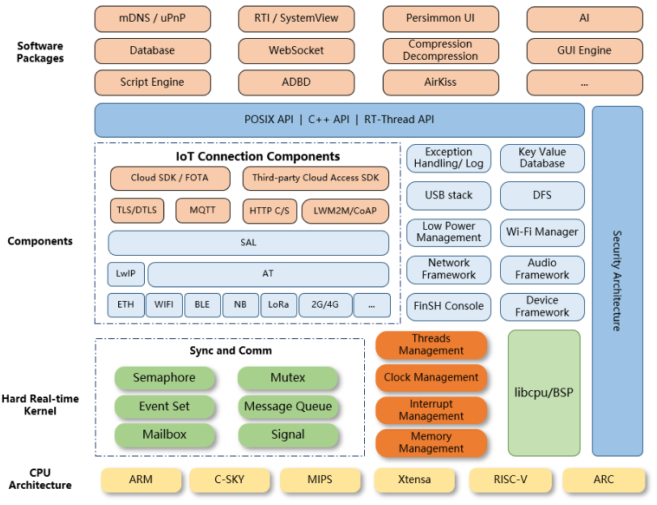

## Hardware

## Development Board Specifications

### CPU
- **Model:** STM32H750VBt6
- **Features:**
  - High-performance microcontroller
  - Multiple communication interfaces
  - Support for complex applications

### Onboard Resources

- **CAN Interfaces:**
  - **CANFD1:** TJA1042
  - **CANFD2:** External TJA1042
- **Ethernet PHY:** LAN8720A
- **USART:** USART1

 

## Software

### Introduction of RT-Thread

RT-Thread is a lightweight real-time operating system designed for embedded systems. It offers a wide range of features, including support for multiple communication interfaces, robustness, and compatibility with various development boards.

### Why use RT-thread
#### Comprehensive Documentation Support:

RT-Thread provides detailed official documentation and community resources, covering everything from getting started to advanced usage. This helps developers quickly get up to speed and resolve issues during development.

#### Well-Structured Code:

The codebase of RT-Thread is well-organized and follows strict coding standards. This enhances code readability and maintainability, making it easier for team collaboration and code reviews.

#### Rich Package Management:

RT-Thread includes a powerful package management system with a vast collection of middleware and components, such as network protocol stacks, file systems, and graphics libraries. These packages can be easily integrated into projects, accelerating the development process.

#### POSIX Support:

RT-Thread supports the POSIX standard, allowing many POSIX-based applications and libraries to be easily ported to the RT-Thread platform. This compatibility significantly expands the available software resources and simplifies project migration and expansion.