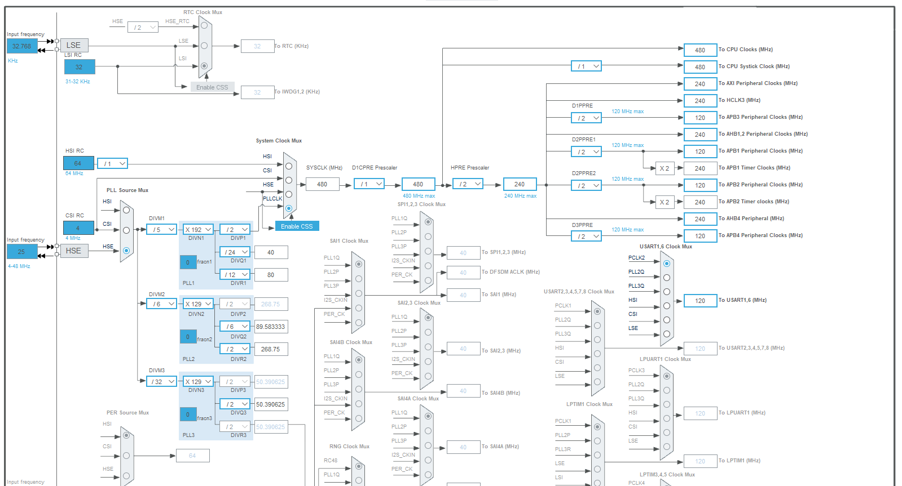
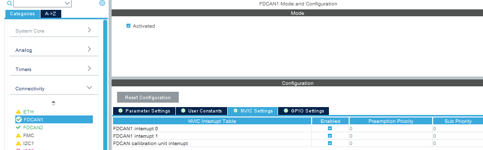
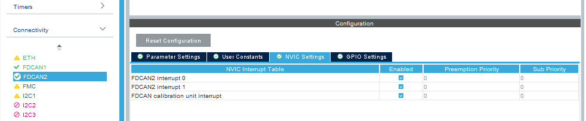
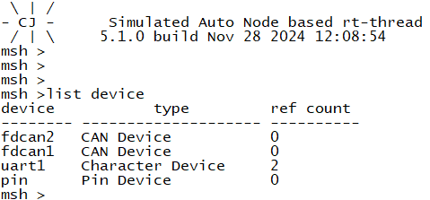
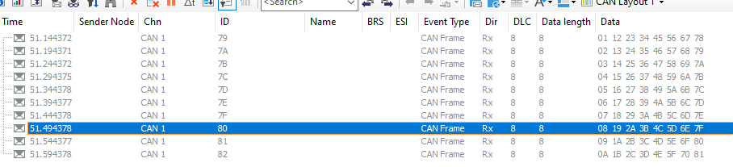
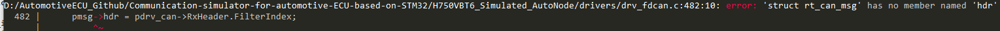
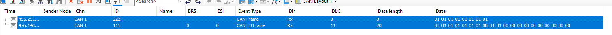

# Way to implement FDCAN

`based on STM32H750VBT6`

## 1.Clock setting

Config clock to 40Mhz, which would be used to calculate BR and Sample rate.

 

 

## 2. IO Config

```c
/*
*FDCAN1 GPIO Configuration
PD0     ------> FDCAN1_RX
PD1     ------> FDCAN1_TX
*/
/*
*FDCAN2 GPIO Configuration
PB5     ------> FDCAN2_RX
PB6     ------> FDCAN2_TX
*/
```


 

 

## 3. Implement drv_fdcan.c

```
	{CAN500kBaud,   1,16,63,16},
```

Configure the BR by manual code .

 

## 2. Test CAN currently only normal CAN

```c

int can_test(int argc, char *argv[])
{
    struct rt_can_msg msg = {0};
    rt_err_t res;
    rt_size_t size;
    rt_thread_t thread;
    char can_name[RT_NAME_MAX];

    if (argc == 2)
    {
        rt_strncpy(can_name, argv[1], RT_NAME_MAX);
    }
    else
    {
        rt_strncpy(can_name, CAN_DEV_NAME, RT_NAME_MAX);
    }

    can_dev = rt_device_find(can_name);
    if (!can_dev)
    {
        rt_kprintf("find %s failed!\n", can_name);
        return RT_ERROR;
    }
    else
    {
        rt_kprintf("find %s success!\n", can_name);
    }

    rt_sem_init(&rx_sem, "rx_sem", 0, RT_IPC_FLAG_FIFO);

    res = rt_device_open(can_dev, RT_DEVICE_FLAG_INT_TX | RT_DEVICE_FLAG_INT_RX);
    RT_ASSERT(res == RT_EOK);

    thread = rt_thread_create("can_rx", can_rx_thread, RT_NULL, 1024, 25, 10);
    if (thread != RT_NULL)
    {
        rt_thread_startup(thread);
    }
    else
    {
        rt_kprintf("create can_rx thread failed!\n");
    }

    msg.id = 0x78;
    msg.ide = RT_CAN_STDID;
    msg.rtr = RT_CAN_DTR;
    msg.len = 8;

    msg.data[0] = 0x00;
    msg.data[1] = 0x11;
    msg.data[2] = 0x22;
    msg.data[3] = 0x33;
    msg.data[4] = 0x44;
    msg.data[5] = 0x55;
    msg.data[6] = 0x66;
    msg.data[7] = 0x77;

    for (rt_uint8_t send_ind = 0; send_ind < 10; send_ind++)
    {
        rt_thread_mdelay(50);
        msg.id = 0x78 + send_ind + 1;
        msg.data[0] = msg.data[0] + 0x01;
        msg.data[1] = msg.data[1] + 0x01;
        msg.data[2] = msg.data[2] + 0x01;
        msg.data[3] = msg.data[3] + 0x01;
        msg.data[4] = msg.data[4] + 0x01;
        msg.data[5] = msg.data[5] + 0x01;
        msg.data[6] = msg.data[6] + 0x01;
        msg.data[7] = msg.data[7] + 0x01;

        size = rt_device_write(can_dev, 0, &msg, sizeof(msg));
        if (size == 0)
        {
            rt_kprintf("can dev write data failed!\n");
        }
    }

    return res;
}

MSH_CMD_EXPORT(can_test, can device sample);
```

 

**both FDCAN1 & FDCAN2 can work ok!**

`CANFD` workOK as well

 


---

### rt-thread BSP中的drv_fdcan.c 的一些改进

- 编译报错, 驱动与主线can.c/h定义的结构体使用有差异

    

- 完善参数设置

    当前drv_fdcan.c只支持normal CAN的配置，因此只能发送CAN Frame， 如果需要发送CAN FD Frame，还需要额外的设置，由于CANFD的配置是可以兼容CAN的，因此我建议将drv_fdcan.c的配置一并配置完全 

    - 根据FDCAN的时钟来进行 仲裁域的设置，数据域的配置，包括波特率以及采样率, `_stm32_fdcan_NTconfig_t`可以将这个结构体扩充信息，来完成FD的配置

    - 由于HAL库的len长度超过8bytes之后是根据DLC解析的，因此还需要一个len -> DLC的转化函数

- 发送参数的get

    `rt_can_msg`这个结构体里面是有fd_frame的成员的，因此驱动需要跟这个标志为来发送CAN Frame或者 CAN FD Frame

    

     

    
