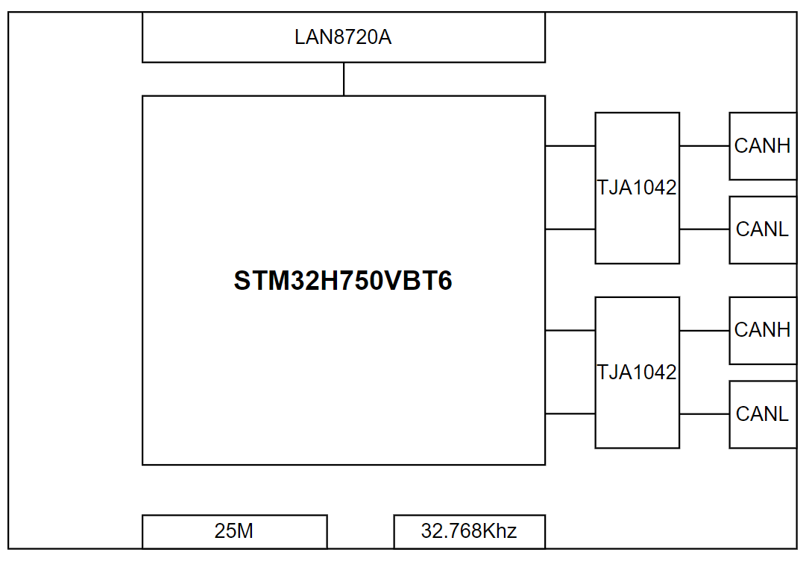

# 1 背景

本人汽车电子行业从业多年，最近两年主要从事CAN,LIN,ETH的功能开发。前几日与测试小伙伴沟通的时候谈到，虽然目前在前期功能验证的时候，Vector公司提供的基于CANOE软件和CAPL脚本的测试环境可以完全模拟各类汽车通信网络的上的任意节点的任意功能，但是由于价格极其昂贵，所以在项目预算吃紧的情况下，无法做到license的完全人手一份的前提下，是否能够做一些替代的方案。因此我想到，我可以进行一些有趣的尝试：

- 购入市面上较为便宜的CAN盒，LIN盒，ETH转T1的盒子等，然后通过python等脚本语言来完成节点的行为模拟 
- 使用STM32，GD32等价格亲民的片子来自己做一个模拟的节点，应用ETH，CAN，LIN等协议栈，通过开源的项目来完成节点的行为模拟

通过一段时间的研究，我发现方案2会更加具有挑战且对软硬件的掌控更加自如，因此**我打算基于网络上全开源的项目来完成我的这个设想。**

# 2 目的：

如图所示，由于CAN网络是汽车通讯网络中最常见也最常用的，并且考虑到单片机的外设IO资源，目前计划采用两路CANFD和一路ETH来完成几个以下比较常规的功能。

- 节点作为支持CANFD的Node，可以完成对CANFD的报文收发，报文过滤，报文重发等功能

- 节点作为支持Router的Node，可以完成对CANFD->CANFD，CANFD->CAN, CAN->CAN, CAN->CANFD,ETH->CAN的数据路由

- 节点作为支持UDS的Node，可以完成对诊断服务的响应。
    - CAN 网络需要支持`ISO11898-1,2,3`, `ISO 15765-2`, `ISO 14229-3`规范
    - ETH 需要支持`ISO 13400-3,2`,`ISO 14229-5`规范

    

# 3 环境：

## 3.1 硬件

初步选型了STM32H750VBT6,网络上的板子价格相对都比较便宜，并且性能不弱，必要时甚至可以扩充ROM，此外自带两路FDCAN，再加上ETH的支持，所以性价比很高。硬件拓扑如下

    

## 3.2 软件

软件么，就毋庸置疑了，哈哈，之前就接触过rt-thread，没有真正的使用过，正好接这个机会来更加深入的了解下rt-thread。

# 4 当前实现的工作内容

由于我在标题标记了(1)，说明在STM32H750VBT6上没有任何经验的情况还是存在一些坑的，因此本文内容仅描述了如何在**没有使能硬件过滤功能**的前提下实现基于CANFD的对CAN FD Frame，CAN Frame的收发。硬件过滤的部分需要其他的工作来做更进一步的描述。

## 4.1 

1.

2.

3.

测试：

