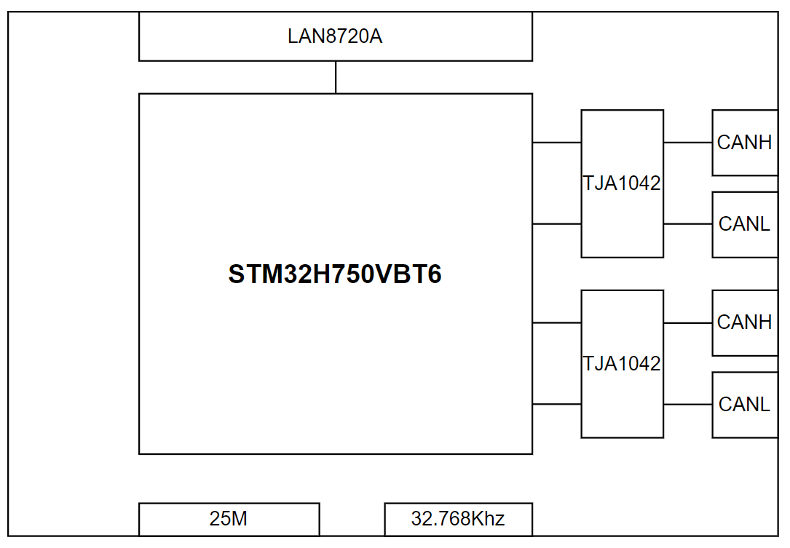

# 1 背景

本人汽车电子行业从业多年，最近两年主要从事CAN,LIN,ETH的功能开发。前几日与测试小伙伴沟通的时候谈到，虽然目前在前期功能验证的时候，Vector公司提供的基于CANOE软件和CAPL脚本的测试环境可以完全模拟各类汽车通信网络的上的任意节点的任意功能，但是由于价格极其昂贵，所以在项目预算吃紧的情况下，无法做到license的完全人手一份的前提下，是否能够做一些替代的方案。因此我想到，我可以进行一些有趣的尝试：

- 购入市面上较为便宜的CAN盒，LIN盒，ETH转T1的盒子等，然后通过python等脚本语言来完成节点的行为模拟 
- 使用STM32，GD32等价格亲民的片子来自己做一个模拟的节点，应用ETH，CAN，LIN等协议栈，通过开源的项目来完成节点的行为模拟

通过一段时间的研究，我发现方案2会更加具有挑战且对软硬件的掌控更加自如，因此**我打算基于网络上全开源的项目来完成我的这个设想。**

# 2 目的：

如图所示，我的初期目标还是相对比较简单的，由于CAN网络是汽车通讯网络中最常见也最常用的，并且考虑到单片机的外设io资源，性能等，我打算采用两路CANFD和一路ETH来做几个以下比较常规的功能。

- 节点作为支持CANFD的Node，可以完成对CANFD的报文收发，报文过滤，报文重发等功能

- 节点作为支持Router的Node，对DoCAN->DoCAN, Doip->DoCAN的诊断路由以及CANFD->CANFD的直接路由


- 节点作为支持UDS的Node，可以完成对诊断服务的响应。

- 节点需要支持CAN
<div style="display: flex; justify-content: center;">    </div>

# 3 环境：

## 3.1 硬件

初步选型了STM32H750VBT6,网络上的板子价格相对都比较便宜，并且性能不弱，必要时甚至可以扩充ROM，此外自带两路FDCAN，再加上ETH的支持，所以性价比很高。硬件拓扑如下

<p style="text-align:center;">    </p>

## 3.2 软件

软件么，就毋庸置疑了，哈哈，之前就接触过rt-thread，没有真正的使用过，正好接这个机会来更加深入的了解下rt-thread。

# 4 当前实现的工作

由于我在标题标记了(1)，说明STM32H750在CANFD部分的工作需要多个part来描述，因此本文内容仅描述了如何在**没有使能硬件过滤功能**的前提下实现基于HAL-FDCAN和TJA1042收发器对CAN FD Frame，CAN Frame的收发实现。硬件过滤的部分需要其他的工作来做更进一步的描述。

## 4.1 创建工程以及配置

由于我更习惯CLI的工作方式，因此完成下述步骤之后就算基本完成了工程的配置

- 直接使用studio创建如下工程，创建完成之后不再使用，后续编译使用cmake + gcc， 调试使用pyocd + daplink
-  后续使用ENV环境来配置


编译完成后可以直接烧录并且在串口输出


## 4.2 时钟配置

Note： 计算CANFD的冲裁域以及数据域的波特率和采样率的源头来自于与FDCAN的时钟频率，其实根据实际板子配置之后，可以将FDCAN的时钟配置为常见的20MHZ，40MHZ，80MHZ中的一个，我当前选择了40 MHz

 

## 4.3 使能CAN的配置

### 4.3.1

### `ENV`

RT-Thread Components -> Device Drivers -> [* ]  **Using CAN device drivers***

​												[ ]     Enable CAN hardware filter

​												[*]     **Enable CANFD support**

保存配置之后

 

### 4.3.2 CubeMx

4.3.2.1 使能FDCAN1和FDCAN2


4.3.2.2 生成代码的使用

根据选择方式的不同，代码生成位置也会不同，只需要保证drv在调用HAL驱动的时候可以被正确call到即可，具体细节不再赘述，论坛文章颇多。

## 4.4 完善CANFD的设备驱动

### 4.4.1 添加宏

在 `board.h`中添加宏

```c
/*#define BSP_USING_ON_CHIP_FLASH*/
#define BSP_USING_FDCAN
#define BSP_USING_FDCAN1
#define BSP_USING_FDCAN2		
```

### 4.4.2 添加drv_fdcan.c

根据rtthread的驱动模型，kernel在can.c中提供了can设备各类操作的抽象，但是对CAN控制器的具体操作需要一个设备驱动来完成，而在5.1.0的软件中只有drv_can.c且里面只支持CAN_HAL。 在一番搜索之后发现ARTPI官方例子中有drv_fdcan.c的文件，可以支持FDCAN_HAL。然而这个驱动存在以下几个小问题，导致其只能发送can帧，而不能发送canfd帧

- 只支持仲裁域配置，无数据域配置
- 只支持配置成classic模式，没有配置成FD模式的接口
- 没有提供一个类似于drv_can.c里面提供的在不同时钟频率下的不同波特率和采样率的数据设置集合
- 没有提供对Txfifo, txbuffer等方式的灵活设置的接口
- 不支持数据长度大于8的发送和接收，且没有提供Length与DLC之间的转换接口。
- 等等其他

### 4.4.3 完成对drv_fdcan.c的一些改进之后，一些重要的配置项如下

- 时间参数设置的规则

    ```
    1波特率 = (1 / (n + tseg1 + tseg2)) * fclk
    ```

- 如果配置为40Mhz, 仲裁段500K -80%采样率，数据段2000K-70%采样率

    ```
      /* 位时序配置:
        ************************
        位时序参数         		  | Normal      |  Data
        --------------------------|--------------|----------------
        CAN子系统内核时钟输入	    | 40 MHz       | 40 MHz
        时间常量                   | 25 ns        | 25 ns
        相位段1            		| 63 tq         | 13 tq
        相位段2  	          	    | 16 tq         | 6 tq
        同步跳转宽度				  | 16 tq         | 6 tq
        位长度         		    | 40 tq = 1 us | 40 tq = 1 us
        位速率             		| 500k  	   | 2 MBit/s
    ```


### 4.4.4 总线初始化

当完成配置，编译烧录之后，启动系统会自动初始化fdcan1和fdcan2

 


## 4.5 测试

### 4.5.1 测试结果

完成驱动之后，使用FINISH接口编写了一个FDCAN的测试接口，测试代码如下

```shell
# fdcanx -- can通道，
#canid -- can msg ID， 
#isfd -- 是否fd帧， 
#len -- 数据长度
canfd_send fdcanx canid isfd len
```

测试结果 ->如图所示，分别发送了如下命令

 

```
canfd_send fdcan1 0x123 1 12
canfd_send fdcan1 0x125 0 6
canfd_send fdcan1 0x124 1 6
canfd_send fdcan1 0x122 1 64
```

### 4.5.2 测试结论

可以通过APP层的参数控制，并且由于CANFD对CAN是完全兼容的特性，可以实现在STM32H750+TJA1042的组合上发送

- 长度为1-8的CAN Frame
- 长度为1-64的CAN FD Frame

# 5 未完成的工作

- 对HDR过滤器的配置，目前FDCAN的过滤配置有多种模式，需要从can. -> drv.fdcan.c 的链路上优化配置HDR的方式
- 对canfd的高数据下的链路性能以及压力测试
- 文档中的一些设置描述比较粗略，会再补充细节的。

